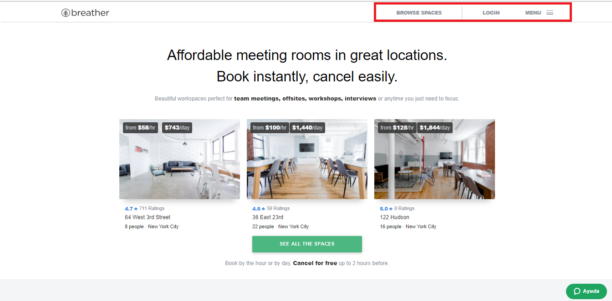
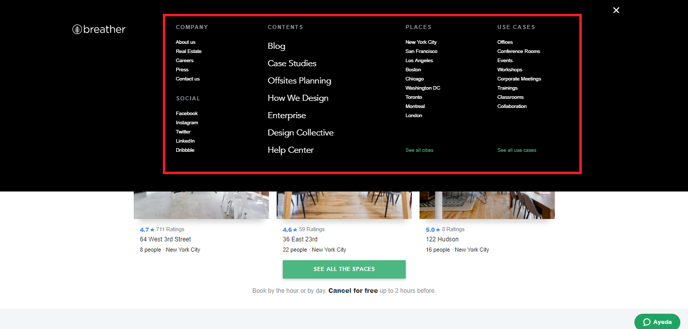
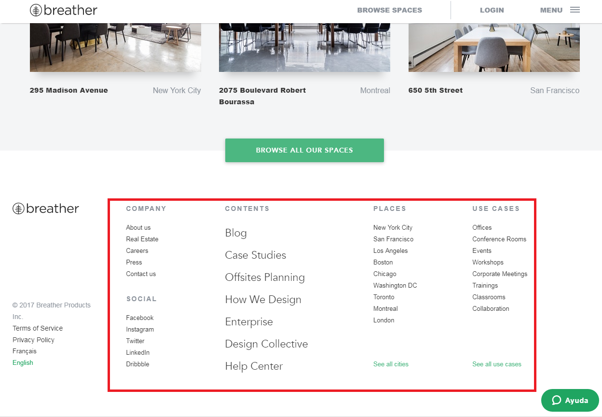
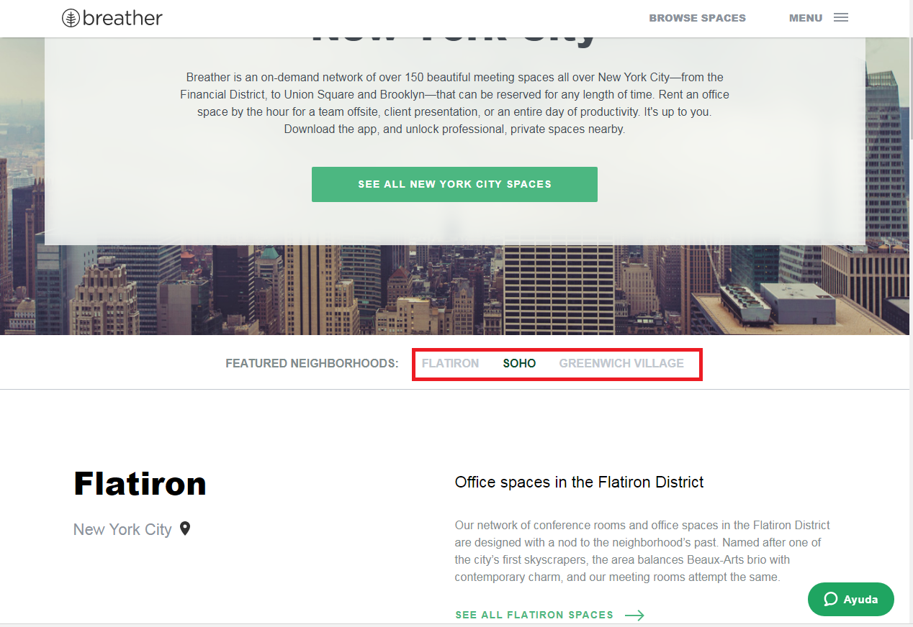
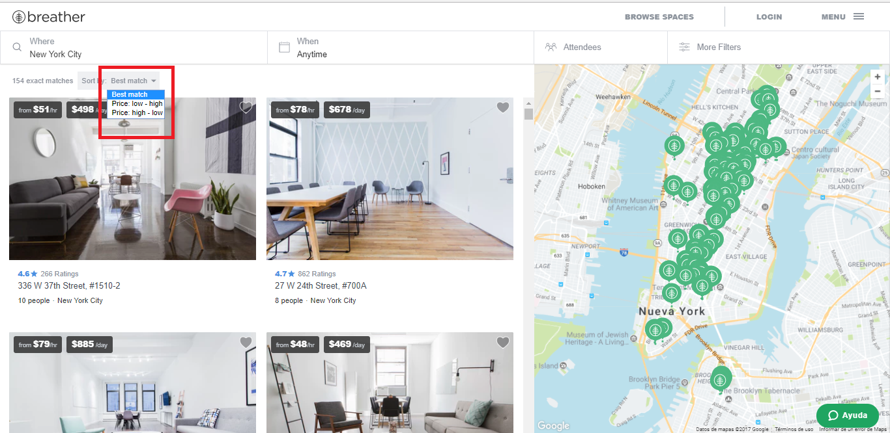
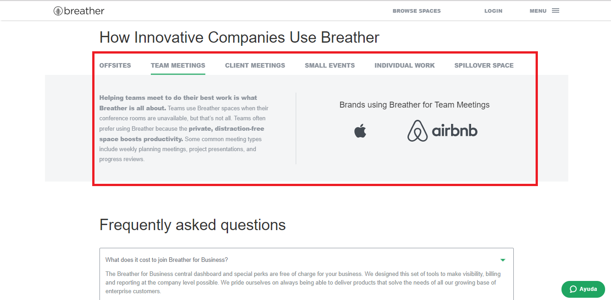

# Navegación web

* **Curso:** _Creando tu primer sitio web interactivo_
* **Unidad:** _ Intro a User Experience Design_

***

## Objetivo

Identifica los elementos de navegación en los siguientes sites:
* Breather
* Github
* Medium

## Desarrollo

### Breather

* Navegación global:

* Navegación local:

* Navegación filtrada:

* Navegación facetada:

* Navegación contextual:

* Navegación inline:

### Github

### Medium
