# Navegación web

* **Curso:** _Creando tu primer sitio web interactivo_
* **Unidad:** _ Intro a User Experience Design_

***

## Objetivo

Identifica los elementos de navegación en los siguientes sites:
* Breather
* Github
* Medium

## Desarrollo

### Breather

#### * Navegación global:

#### * Navegación local:

#### * Navegación filtrada:

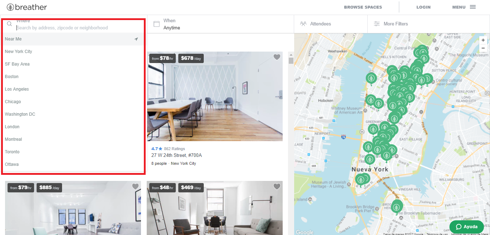

#### * Navegación facetada:

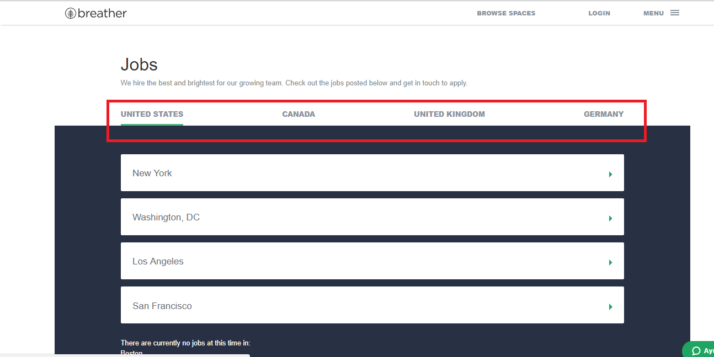

#### * Navegación contextual:

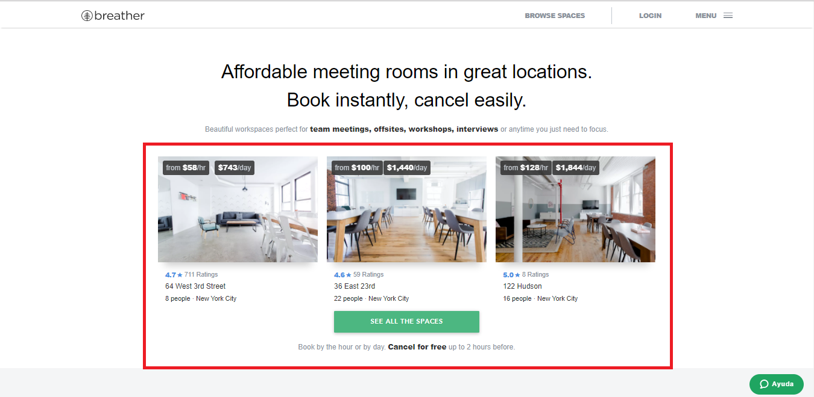

#### * Navegación inline:

### Github

#### * Navegación global:

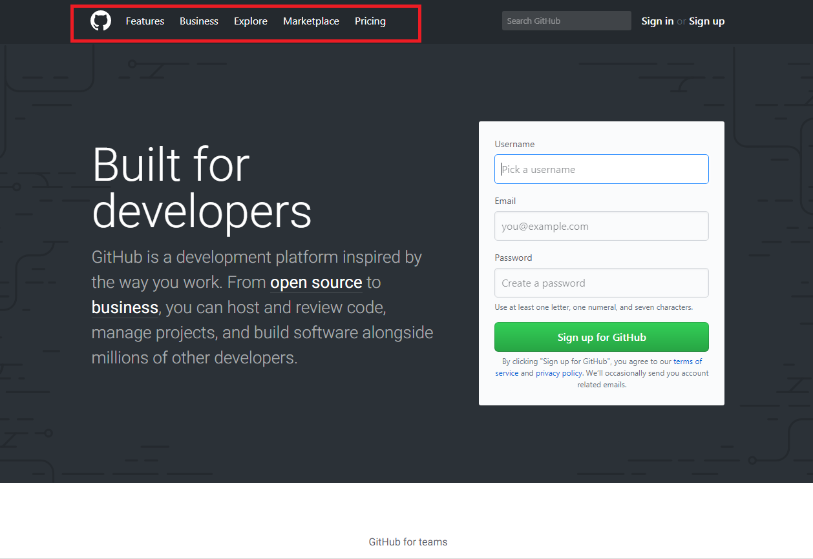
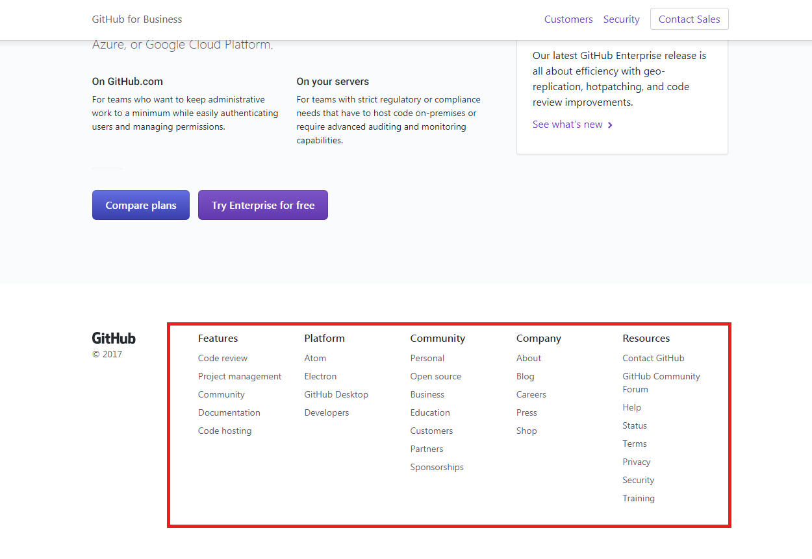

#### * Navegación local:

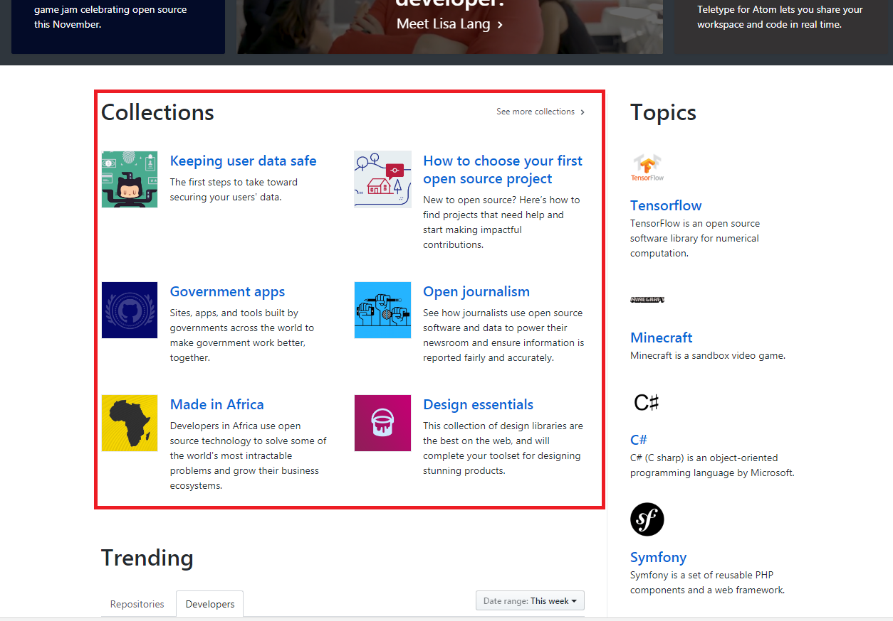
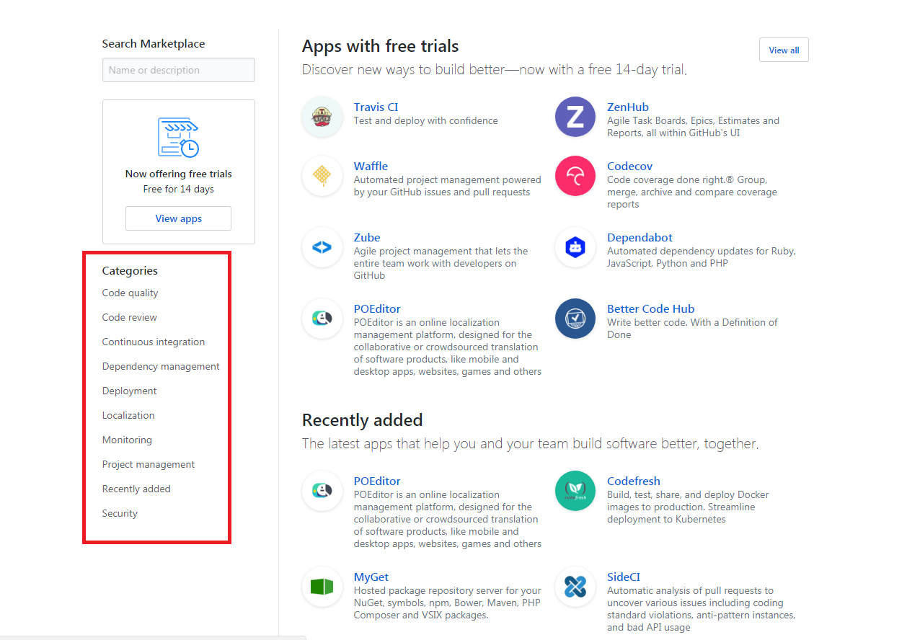

#### * Navegación filtrada:

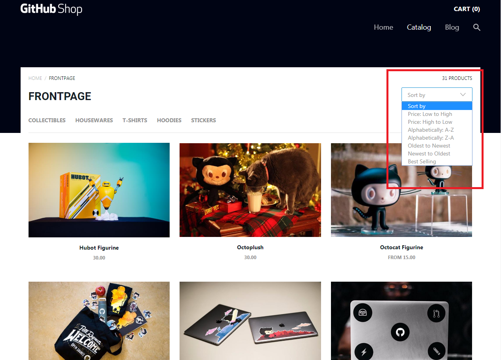

#### * Navegación facetada:

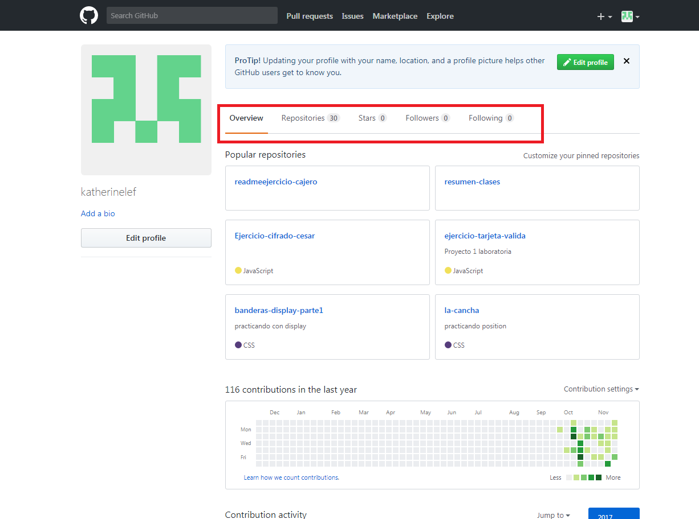
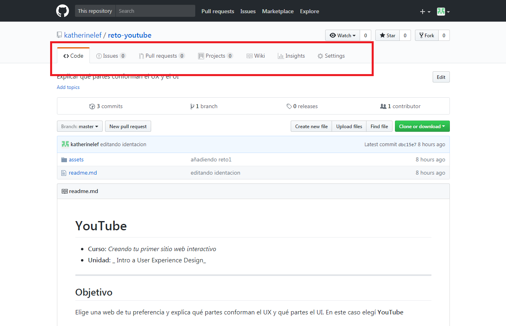

#### * Navegación inline:

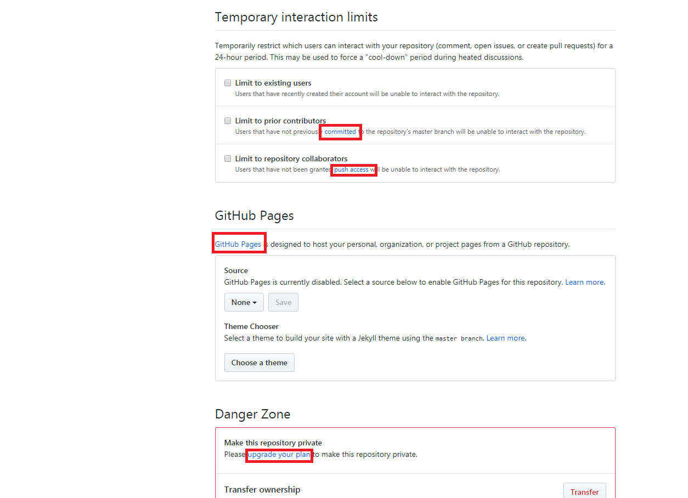

### Medium
